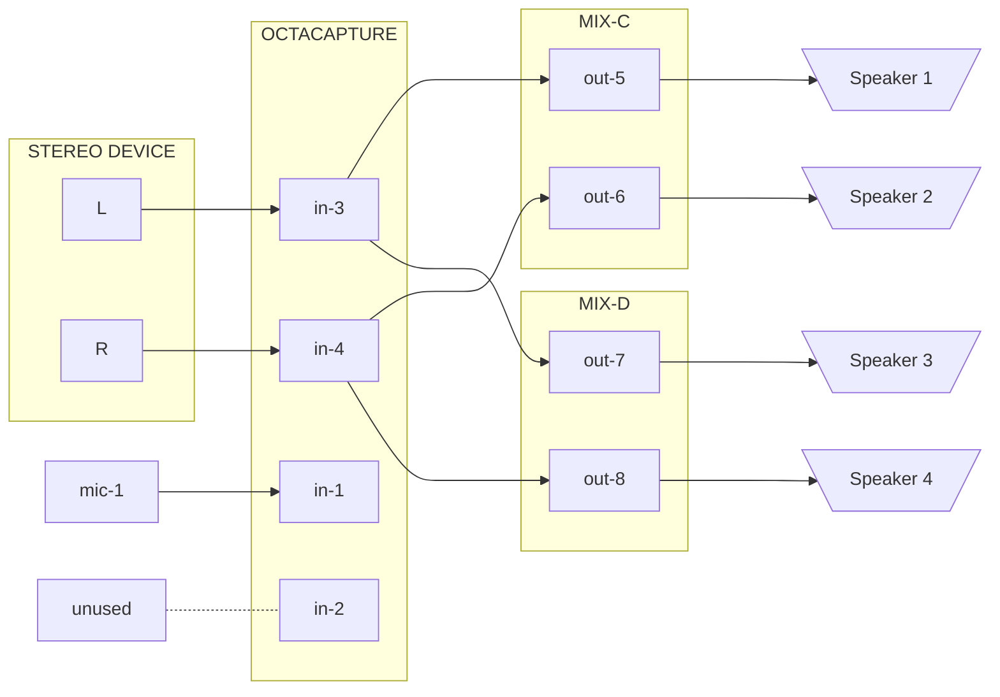

```mermaid
flowchart LR
	mic-1 --> in-1
	unused -.- in-2
	subgraph STEREO DEVICE
		L
		R
	end
	subgraph OCTACAPTURE
		in-1
		in-2
		in-3
		in-4
	end
	subgraph MIX-C
		out-5
		out-6
	end
	subgraph MIX-D
		out-7
		out-8
	end
	L --> in-3
	R --> in-4
	in-3 ---> out-5
	in-4 ---> out-6
	in-3 ---> out-7
	in-4 ---> out-8
	out-5 --->S1[\Speaker 1/]
	out-6 --->S2[\Speaker 2/]
	out-7 --->S3[\Speaker 3/]
	out-8 --->S4[\Speaker 4/]
```
