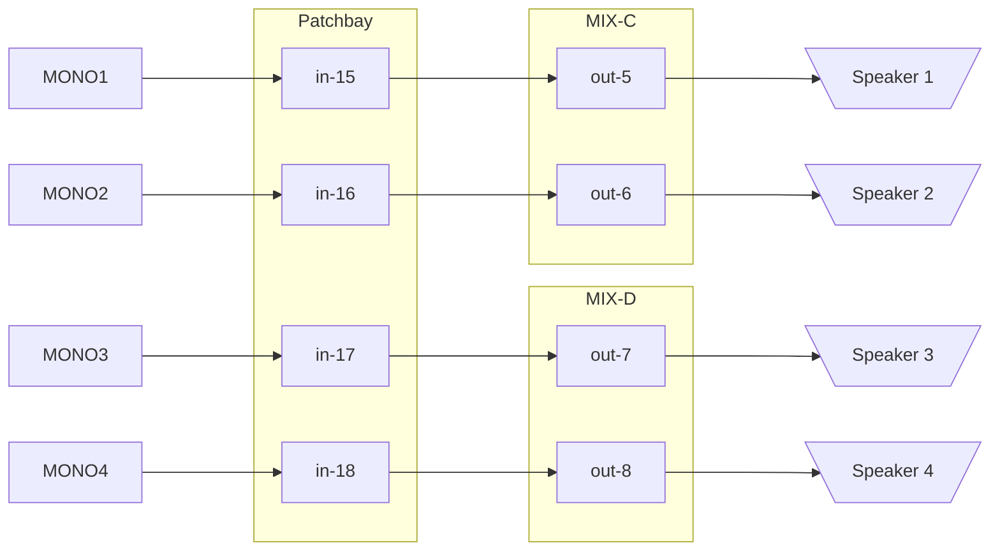

```mermaid
flowchart LR
	subgraph Patchbay
    	in-15
		in-16
		in-17 
		in-18
    end
	subgraph MIX-C
		out-5
		out-6
	end
	subgraph MIX-D
		out-7
		out-8
	end
	MONO1 ---> in-15 ---> out-5 --->S1[\Speaker 1/]
	MONO2 ---> in-16 ---> out-6 --->S2[\Speaker 2/]
	MONO3 ---> in-17 ---> out-7 --->S3[\Speaker 3/]
	MONO4 ---> in-18 ---> out-8 --->S4[\Speaker 4/]
```
