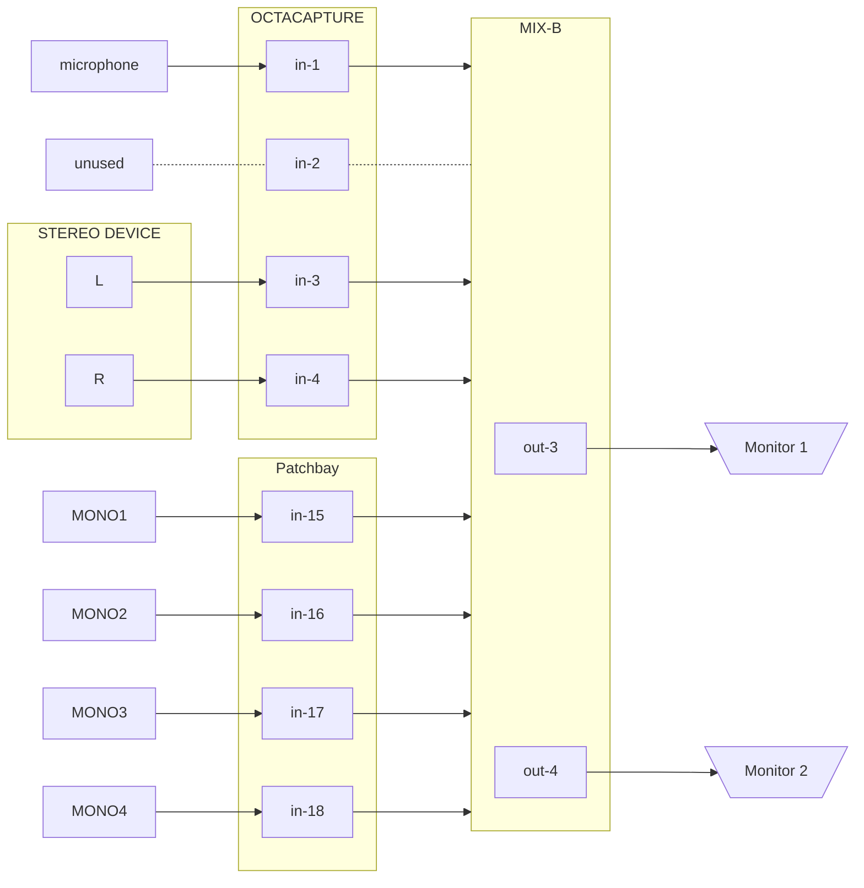

```mermaid
flowchart LR
	subgraph STEREO DEVICE
	L
	R
	end
	subgraph OCTACAPTURE
    in-1
	in-2
	in-3
	in-4
	end
	subgraph Patchbay
    in-15
	in-16
	in-17 
	in-18
    end
	subgraph MIX-B
	out-3
	out-4
	end
	microphone --> in-1 ---> MIX-B
	unused -.- in-2 -.- MIX-B
	L --> in-3 ---> MIX-B
	R --> in-4 ---> MIX-B
	MONO1 --> in-15 ---> MIX-B
	MONO2 --> in-16 ---> MIX-B
	MONO3 --> in-17 ---> MIX-B
	MONO4 --> in-18 ---> MIX-B
	out-3 ---> M1[\Monitor 1/]
	out-4 ---> M2[\Monitor 2/]
```
